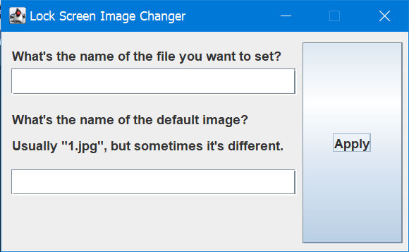

# Lock Screen Changer
## Introduction
I believe there's two registry keys that organisations can enforce on their domain's computers, where the user is unable to change the lock screen image in Windows 10 and the image is set to a predefined one - each of these events is a key respectively.
##### Another problem solvable by switching to Arch, btw!
Anyway, the way the predefined image is set is by placing it in the `C:\Program Files\images\` directory. Usually the default is `1.jpg` in there; but it may change due to an event. National Recycling Week happened and that's what spurred me to create this automated application to automate the process I'd been already doing manually. The National Recycling Week lock screen image was put in `C:\Program Files\images\` too, and its name was `7.jpg`.
This project currently only works with `.jpg` files.

I've made this project Open Source / Source-avaliable on GitHub here in case anyone else is interested or they suffer a similar limitation from their IT team.

## How it Works
The program asks you for two things: The old lock screen image (In my case, `1.jpg` or `7.jpg`); and the filename of the image to replace the lock screen with.
##### The image to replace the lock screen with should be in the same directory as the compiled JAR.
It then creates a Batch script because I'm more comfortable with Batch for filesystem interactions. (Java I find better for everything else!)
It runs the Batch file afterwards, and does all of the file replacing.
Wonderful! The lock screen should stay in the new state until a domain policy update and/or a system drain.

## Installation & Using
### Directly From Source
Use your favourite terminal for this. No dependencies. Just Java.
1. Clone the project: <br>
  **GitHub CLI:**
  ```cmd
  gh repo clone Toydotgame/LockScreenChanger
  ```
  **Git:**
  ```cmd
  git clone https://github.com/Toydotgame/LockScreenChanger
  ```
2. Navigate to the project directory:
 ```cmd
 cd LockScreenChanger
 ```
3. Run `GUI.java` using Java:
 ```cmd
 java src/GUI.java
 ```
### From the [Releases](https://github.com/Toydotgame/LockScreenChanger/releases) Tab
1. Download the latest `.jar` file.
2. Move the file to the location of a `.jpg` file you'd like to set as your lock screen. (In the same folder)
3. Run the `.jar`.
4. Enter the file information: <br>
  <br>
 a) The name of the new background you want. (_Make sure it's a `.jpg` file!_) <br>
 b) The JPEG filename of the image in `C:\Program Files\images\`. In my school's case: `1.jpg`, `2.jpg`, or `7.jpg`.

## Planned Features: (Not certain that they'll be in the app, though!)
* Command-line launch arguments
 * Either with:
  * A seperate version without a GUI which does it straight away; or
  * The current version accepting flags and then running without the GUI and automatically proceeding
* Alternate branch for `.png` files; as the current one uses JPEGs only.
